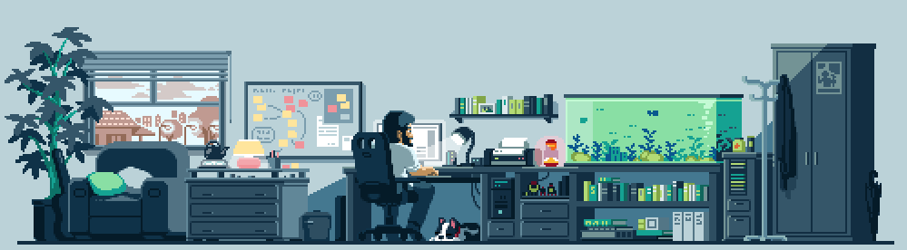

---

## 🚀 About Me
A high school student passionate about IT, especially in **Web Development**, **Full-Stack Development**, and **Cyber Security**. I’m determined to keep learning and sharpening my skills to become a **professional pentester** and an **application developer** who builds secure and meaningful solutions for the future.

<h4>📫 Connect with me</h4>

  
  

## 🛠️ Language & Tools

   
&nbsp;&nbsp;&nbsp;
   
&nbsp;&nbsp;&nbsp;
   
&nbsp;&nbsp;&nbsp;
   
&nbsp;&nbsp;&nbsp;
   
&nbsp;&nbsp;&nbsp;
   

 
<table>
  <tr>
    <td valign="top" align="center">
     
    </td>
    <td valign="top" align="center">
   
    
   
  </tr>
</table>
